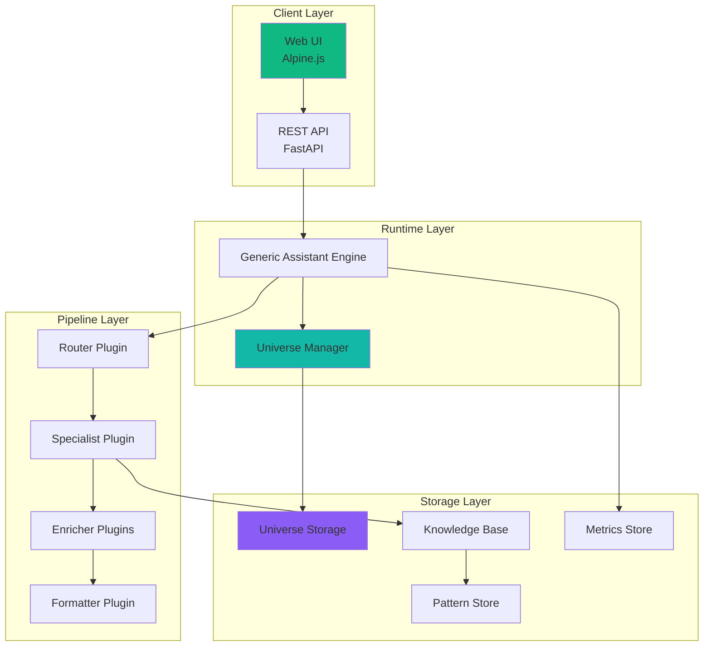
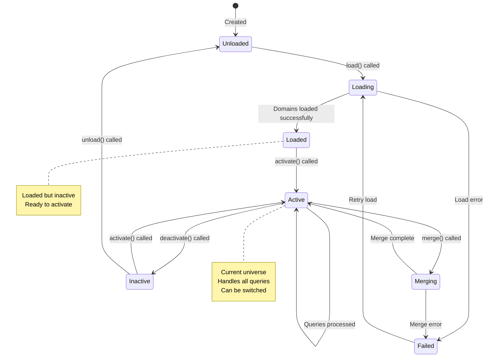
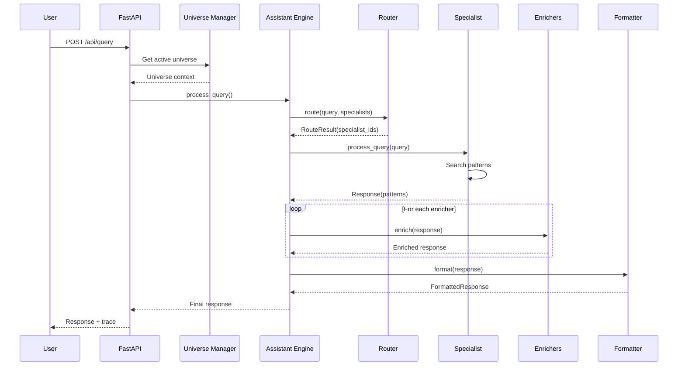
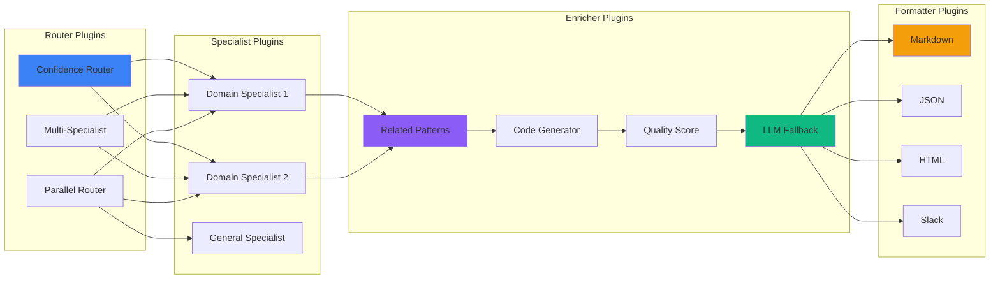
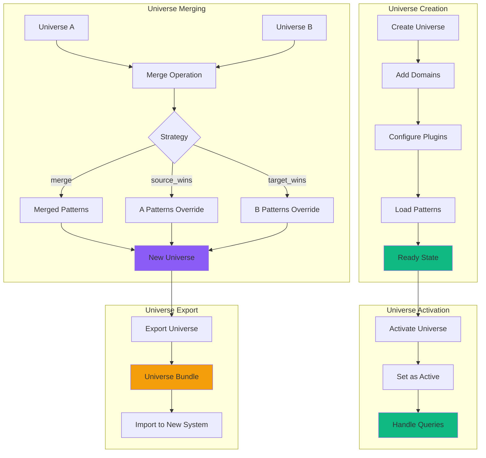

# ExFrame: Expertise Framework
## A Universe-Based, Plugin-Driven Knowledge Management System

---

## Product Overview

**ExFrame** is a domain-agnostic, universe-based AI-powered knowledge management system that enables fast, predictable pattern retrieval with optional LLM enrichment. It achieves this through a **multiverse architecture** where each universe is a complete, self-contained configuration of domains, patterns, search strategies, and plugins.

**Key Value Proposition:**
- **Universe Architecture:** Complete isolation and portability of knowledge configurations
- **Fast Pattern Retrieval:** Sub-millisecond response times for 95%+ of queries
- **Pluggable Pipeline:** Router → Specialist → Enricher → Formatter - all swappable
- **Domain Agnostic:** Works for any knowledge domain that can be patternized
- **Explainable Reasoning:** Every response traced to specific patterns and specialists
- **Multiple Output Formats:** Markdown, JSON, HTML, Slack, Compact, Table, etc.
- **LLM Enrichment:** Hybrid mode combines static patterns with LLM-generated knowledge capture

**Current Version:** 1.2.0
**Status:** Production Ready
**License:** MIT

---

## System Philosophy

### Core Design Principles

#### 1. **Universes as First-Class Entities**

ExFrame treats **universes** as the fundamental unit of organization. A universe is a complete, self-contained knowledge environment:

```
universe/
├── domains/
│   ├── cooking/
│   │   ├── patterns.json      # Knowledge patterns
│   │   └── domain.json        # Domain configuration
│   ├── binary_symmetry/
│   ├── llm_consciousness/
│   └── ...
├── universe.json              # Universe metadata
└── state.json                 # Runtime state
```

**Philosophy:** Each universe represents a complete worldview or area of expertise. You can have:
- A `production` universe with vetted, high-quality patterns
- A `testing` universe for experimental patterns
- A `customer_A` universe with client-specific knowledge
- A `research` universe for cutting-edge, unverified patterns

#### 2. **Pattern-Based Knowledge Representation**

Knowledge is represented as **patterns** - structured, reusable chunks of expertise:

```json
{
  "id": "cooking_001",
  "name": "Mise en Place Setup",
  "pattern_type": "preparation",
  "problem": "Ingredients not ready when needed",
  "solution": "Gather and prepare all ingredients before cooking",
  "steps": ["Read recipe", "Gather ingredients", "Measure portions"],
  "confidence": 0.95
}
```

**Philosophy:** Human expertise is pattern-based. Experts recognize situations and apply proven patterns. ExFrame externalizes this expertise.

#### 3. **LLM as Learner, Not Just Responder**

The LLM Enrichment Plugin doesn't just generate responses - it **learns** from interactions:

```
User Query → Specialist finds partial match → LLM fills gaps →
New pattern captured → Enriched for next query
```

**Philosophy:** The system gets smarter with use. Every query where the LLM is used becomes an opportunity to capture new knowledge.

#### 4. **Composability Over Monolith**

Every stage of the pipeline is a plugin:
- Router plugins determine which specialist handles a query
- Specialist plugins search patterns and generate responses
- Enricher plugins enhance responses with related patterns, code examples
- Formatter plugins control output format

**Philosophy:** Small, focused components that do one thing well. Easy to test, easy to replace.

---

## Architecture Diagrams

### System Architecture



### Universe State Machine



### Query Processing Pipeline



### Plugin Architecture



### Universe Lifecycle



---

## System Components

### 1. Universe Manager

**Purpose:** Manages universe lifecycle, switching, and merging

**Key Methods:**
```python
class UniverseManager:
    async def load_default() -> Universe
    async def load(universe_id: str) -> Universe
    async def activate(universe_id: str)
    async def merge(source_id: str, target_id: str, strategy: str)
    async def export(universe_id: str) -> UniverseBundle
    async def import_bundle(bundle: UniverseBundle)
    list_universes() -> List[str]
    list_loaded_universes() -> List[str]
```

**States:**
- `UNLOADED` - Universe exists but not loaded
- `LOADING` - Currently loading domains and patterns
- `LOADED` - Loaded and ready to activate
- `ACTIVE` - Currently handling queries
- `INACTIVE` - Loaded but not active
- `FAILED` - Load or operation failed
- `MERGING` - Currently merging with another universe

### 2. Generic Assistant Engine

**Purpose:** Processes queries through the pluggable pipeline

**Key Features:**
- Domain auto-discovery within active universe
- Query routing via router plugins
- Response aggregation for multi-specialist queries
- Enrichment pipeline execution
- Format selection and response formatting
- Comprehensive query tracing

### 3. Pattern Storage

**Structure:**
```
universes/
├── default/
│   ├── universe.json
│   ├── domains/
│   │   ├── cooking/
│   │   │   ├── patterns.json
│   │   │   └── domain.json
│   │   ├── binary_symmetry/
│   │   │   ├── patterns.json
│   │   │   └── domain.json
│   │   └── ...
│   └── state.json
├── testing/
└── customer_A/
```

**Pattern Schema:**
```json
{
  "id": "unique_id",
  "name": "Pattern Name",
  "pattern_type": "procedure|troubleshooting|principle|...",
  "problem": "What problem does this solve?",
  "solution": "How is it solved?",
  "steps": ["Step 1", "Step 2"],
  "conditions": {},
  "confidence": 0.95,
  "sources": ["url"],
  "tags": ["tag1", "tag2"],
  "related_patterns": ["pattern_id"]
}
```

### 4. Diagnostic System

**Components:**
- **SearchMetrics** - Track search performance and quality
- **PatternAnalyzer** - Detect orphaned, duplicate, low-confidence patterns
- **HealthChecker** - System-wide health checks
- **SelfTestRunner** - Automated testing with regression detection

**Metrics Tracked:**
- Total searches, success rate, error rate
- Average confidence, patterns found, patterns used
- P50/P95/P99 latency percentiles
- Pattern usage statistics
- LLM fallback rate

---

## API Endpoints

### Universe Management

```
GET    /api/universes                          # List all universes
GET    /api/universes/{id}                     # Get universe details
POST   /api/universes/{id}/load               # Load a universe
POST   /api/universes                          # Create new universe
POST   /api/universes/merge                    # Merge universes
GET    /api/universes/{id}/domains             # List universe domains
POST   /api/universes/{id}/export              # Export universe bundle
POST   /api/universes/import                   # Import universe bundle
```

### Query Endpoints

```
GET/POST /api/query
    Parameters:
        - query: string
        - domain: string (optional, uses active universe's default)
        - format: string (json|html|slack|markdown|compact|table)
        - include_trace: boolean

    Response:
        - response: formatted content
        - trace: execution trace (if requested)
        - specialist: specialist used
        - patterns_matched: patterns found
        - confidence: match confidence
        - processing_time_ms: execution time
```

### Domain Endpoints

```
GET    /api/domains                            # List all domains
GET    /api/domains/{id}                       # Get domain details
GET    /api/domains/{id}/specialists           # List specialists
GET    /api/domains/{id}/patterns              # List patterns
GET    /api/domains/{id}/patterns/{pid}        # Get pattern detail
GET    /api/domains/{id}/health                # Domain health check
```

### Diagnostic Endpoints

```
GET    /api/diagnostics/health                 # System health
GET    /api/diagnostics/metrics                # Search metrics
GET    /api/diagnostics/traces                 # Query traces
GET    /api/diagnostics/patterns/health         # Pattern health
GET    /api/diagnostics/summary                # Complete diagnostics
POST   /api/diagnostics/self-test              # Run test suite
```

---

## Deployment

### Container Architecture

```bash
docker-compose up
├── eeframe-app          # FastAPI + Universe Manager + Plugins
├── prometheus           # Metrics collection
├── grafana              # Metrics visualization
├── loki                 # Log aggregation
└── promtail             # Log collector
```

### Environment Variables

```bash
# LLM Configuration
OPENAI_API_KEY=sk-...
OPENAI_BASE_URL=https://api.openai.com/v1

# Storage
UNIVERSES_BASE=/app/universes
PATTERN_STORAGE_BASE=/app/data/patterns
DOMAIN_REGISTRY_PATH=/app/data

# Logging
LOG_LEVEL=INFO
```

### Health Checks

```bash
# System health
GET /health
{
  "status": "healthy",
  "active_universe": "default",
  "domains_loaded": 8,
  "total_patterns": 63
}

# Domain health
GET /api/domains/cooking/health
{
  "domain": "cooking",
  "patterns_loaded": 21,
  "specialists_available": 3,
  "router_plugin": "ConfidenceBasedRouter",
  "formatter_plugin": "MarkdownFormatter"
}
```

---

## Current Status & Timeline

### Completed Features (v1.2.0)

#### Core Architecture
- ✅ Universe Manager with load/activate/merge/export
- ✅ Generic Assistant Engine with pluggable pipeline
- ✅ JSON-based pattern storage
- ✅ Domain auto-discovery and configuration
- ✅ Multi-format output (Markdown, JSON, HTML, Slack, Compact, Table)

#### Plugin System
- ✅ Router plugins (ConfidenceBased, MultiSpecialist, Parallel)
- ✅ Specialist plugins (domain-specific)
- ✅ Enricher plugins (Related Patterns, Code Generator, Quality Score, LLM Fallback)
- ✅ Formatter plugins (8 different output formats)

#### LLM Integration
- ✅ LLM Enrichment Plugin for knowledge capture
- ✅ Automatic pattern generation from LLM responses
- ✅ Confidence scoring for LLM-generated content
- ✅ Hybrid mode (patterns + LLM)

#### Diagnostics
- ✅ Search metrics tracking (quality, latency, success rate)
- ✅ Pattern health analysis (orphans, duplicates, low-confidence)
- ✅ System health checks (storage, KB, performance, disk space)
- ✅ Self-test runner with regression detection
- ✅ Diagnostics dashboard UI

#### Web Interface
- ✅ Assistant chat interface
- ✅ Pattern browser and editor
- ✅ Domain management
- ✅ Universe management (NEW)
- ✅ Diagnostics dashboard (NEW)
- ✅ Query trace viewer

### In Progress (Phase 2)

#### Universe Frontend & Documentation
- ⏳ Universe comparison UI
- ⏳ Universe export/import UI
- ⏳ Pattern relationship visualization
- ⏳ Comprehensive API documentation

#### Test Coverage
- ⏳ Unit tests for core components
- ⏳ Integration tests for pipeline
- ⏳ Plugin testing framework
- ⏳ CI/CD pipeline setup

### Planned (Phase 3+)

#### Advanced Features
- 🔲 Real-time collaboration on pattern editing
- 🔲 Pattern version control with diff/merge
- 🔲 Advanced pattern relationships (prerequisite, conflicts, includes)
- 🔲 Natural language pattern search
- 🔲 Pattern recommendation engine

#### Enterprise Features
- 🔲 SAML/SSO authentication
- 🔲 Role-based access control
- 🔲 Audit logging
- 🔲 Multi-region deployment
- 🔲 Plugin marketplace

---

## Use Cases

### Ideal For

✅ **Knowledge Transfer**
- Expert systems for specialized domains
- Onboarding automation
- SOP and procedure management

✅ **Customer Support**
- Technical support knowledge bases
- FAQ automation
- Troubleshooting guides

✅ **Education & Training**
- Course content delivery
- Tutorial repositories
- Interactive learning systems

✅ **Development Operations**
- Code pattern libraries
- Deployment procedures
- Incident response runbooks

### Not Ideal For

❌ **Real-Time Data**
- Stock prices, weather, live metrics
- Streaming data analysis

❌ **Unstructured Knowledge**
- Free-form document repositories
- General web search

❌ **Novel Synthesis**
- Creating entirely new theories
- Original research generation

---

## Philosophy Deep Dive

### Why Universes?

**Problem:** Different contexts need different knowledge bases
- Production vs testing vs development
- Customer-specific customizations
- Different regulatory requirements
- Vetting and approval workflows

**Solution:** Universes as isolated, portable knowledge environments

Each universe is:
1. **Complete** - Contains all domains, patterns, and configuration
2. **Isolated** - Changes don't affect other universes
3. **Portable** - Can be exported, imported, shared
4. **Switchable** - Hot-swappable at runtime
5. **Mergeable** - Can combine universes with conflict resolution

### Why Patterns?

**Problem:** Knowledge is often tacit, unstructured, and trapped in documents
- "How do I fix X?" requires searching through docs
- Expert intuition is rarely documented
- Reusing past solutions is difficult

**Solution:** Explicit pattern representation

Patterns capture:
1. **Problem** - What situation does this address?
2. **Solution** - How is it solved?
3. **Context** - When does this apply?
4. **Confidence** - How reliable is this pattern?
5. **Relationships** - What related patterns exist?

### Why Plugin Pipeline?

**Problem:** Monolithic systems are hard to customize and extend
- Every change risks breaking existing functionality
- Customization requires forking the entire codebase
- Testing is difficult

**Solution:** Pluggable transformation pipeline

Benefits:
1. **Composability** - Mix and match components
2. **Testability** - Test plugins in isolation
3. **Extensibility** - Add new functionality without modifying core
4. **Flexibility** - Swap components for different use cases

---

## Quick Start

### 1. Start the System

```bash
git clone https://github.com/your-org/eeframe.git
cd eeframe
docker-compose up -d
```

### 2. Access the Web UI

```
http://localhost:3000
```

### 3. Query the System

```bash
curl -X POST http://localhost:3000/api/query \
  -H "Content-Type: application/json" \
  -d '{
    "query": "How do I reverse bits in a byte?",
    "domain": "binary_symmetry",
    "format": "markdown"
  }'
```

### 4. Create a New Universe

```bash
curl -X POST http://localhost:3000/api/universes \
  -H "Content-Type: application/json" \
  -d '{
    "universe_id": "my_universe",
    "description": "My custom universe"
  }'
```

### 5. Switch Universes

```bash
curl -X POST http://localhost:3000/api/universes/my_universe/load
```

---

## Contributing

We welcome contributions! Areas of interest:

- New router plugins
- New enricher plugins
- New formatter plugins
- Domain-specific specialists
- Documentation improvements
- Bug fixes and performance improvements

See `CONTRIBUTING.md` for guidelines.

---

## License

MIT License - See LICENSE file for details

---

**For:**
- Teams building knowledge management systems
- Organizations capturing institutional knowledge
- Developers creating AI assistants
- Domain experts sharing expertise

**Version:** 1.2.0
**Status:** Production Ready
**Last Updated:** January 2026
