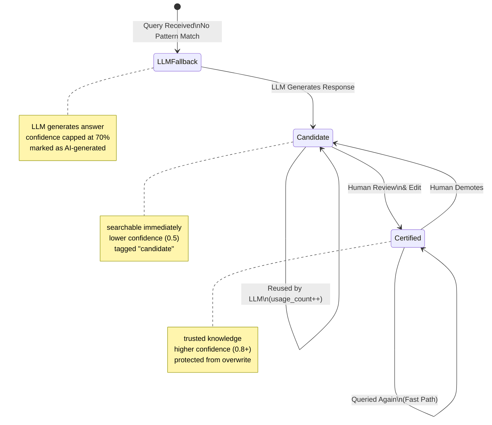
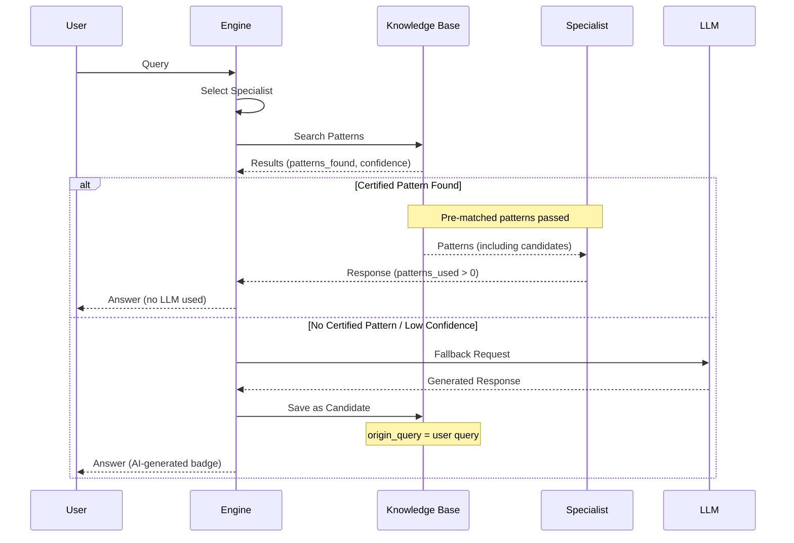

# ExFrame (Expertise Framework)

## A Hybrid Memory System for AI Agents

**Version 1.2.0** | January 2026

---

## Overview

ExFrame is a domain-agnostic expertise framework that combines **pattern-based knowledge** with **LLM fallback** to create a persistent memory system for AI agents. When an LLM generates knowledge, it's captured as a "candidate" pattern that can be certified by humans and reused in future queries.

### The Key Innovation

**Every LLM response becomes a candidate for permanent memory.**

When the system falls back to LLM generation (because no certified pattern exists), that LLM response is automatically saved as a candidate pattern. Human experts can then review, edit, and certify these patterns. Once certified, the pattern becomes part of the permanent knowledge base and the LLM is no longer needed for that query.

---

## The Pattern Lifecycle State Machine



---

## Query Flow Architecture



---

## The Milestone: First Loop Closed

### What Just Happened

1. **Initial Query**: User asked "What is Gray code and why is it useful?"
2. **No Pattern**: System had no matching pattern
3. **LLM Fallback**: LLM generated comprehensive answer
4. **Candidate Created**: Response saved as `binary_symmetry_candidate_018`
5. **Human Review**: User certified the pattern (80% confidence)
6. **Reuse**: Subsequent queries now use certified pattern instantly

### The Loop Is Now Complete

```
┌─────────────────────────────────────────────────────────────┐
│                    THE KNOWLEDGE LOOP                        │
├─────────────────────────────────────────────────────────────┤
│                                                              │
│   User Query → Search → (No Match?) → LLM Generate → Save   │
│                                     ↓                        │
│                              Candidate Pattern              │
│                                     ↓                        │
│                              Human Certification             │
│                                     ↓                        │
│                              Certified Pattern               │
│                                     ↓                        │
│                           Instant Future Matching            │
│                                                              │
└─────────────────────────────────────────────────────────────┘
```

**This is how AI systems learn.**

---

## Pattern States Explained

### Candidate Pattern (`status: "candidate"`)

- **Created automatically** when LLM generates a response
- **Fully searchable** and can match queries immediately
- **Confidence**: 0.5 (default) or as set by human
- **Tags**: `["candidate", "llm_generated"]`
- **Fields**:
  - `origin_query`: The query that triggered LLM generation
  - `generated_by`: Which LLM created it (e.g., "glm-4.7")
  - `generated_at`: Timestamp of generation
  - `usage_count`: How many times this pattern has been accessed

**Purpose**: Temporary storage for LLM knowledge awaiting human review.

### Certified Pattern (`status: "certified"`)

- **Created or promoted** by human review
- **Protected** from being overwritten by LLM responses
- **Confidence**: 0.8+ (human-specified)
- **Tags**: `["certified"]` (candidate/llm_generated tags removed)
- **Fields**:
  - `reviewed_by`: Human reviewer identifier
  - `reviewed_at`: Certification timestamp
  - `review_notes`: Optional notes from reviewer

**Purpose**: Trusted, permanent knowledge in the system.

---

## Key Components

### 1. Domain Registry
- Maps domain IDs to their configurations
- Each domain has:
  - Specialists (experts in specific subtopics)
  - Knowledge base (pattern storage)
  - Enrichers (LLM fallback, quality scoring)

### 2. Specialist Plugins
- Domain experts who handle specific query types
- **NEW**: Now receive pre-matched patterns from engine
- No longer re-search with category filters (efficiency gain)

### 3. Knowledge Base (JSON)
- Pattern storage in `data/patterns/{domain}/patterns.json`
- Full-text search across all pattern fields
- Returns relevance-sorted results

### 4. LLM Fallback Enricher
- Only activates when:
  - No certified patterns found, OR
  - Overall confidence below threshold (default 0.3)
- Skips LLM if certified pattern exists (prevents redundant calls)
- Reduces confidence to max 70% when used (signals uncertainty)

---

## Confidence Calculation

The system calculates confidence to indicate **reliability of the response**:

| Source | Confidence Range | Notes |
|--------|------------------|-------|
| Certified Pattern | 0.8 - 1.0 | Human-verified, trusted |
| Candidate Pattern | 0.3 - 0.7 | LLM-generated, not yet verified |
| LLM Fallback | max 0.7 | Artificially capped to signal uncertainty |
| No Pattern Match | 0.0 | Nothing found |

**Formula**:
```
confidence = base_pattern_score × specialist_boost
if llm_used:
    confidence = min(confidence × 0.7, 0.7)
```

---

## File Structure

```
eeframe/
├── assist/
│   └── engine.py          # Main query orchestrator
├── api/
│   └── app.py             # FastAPI endpoints
├── core/
│   ├── domain.py          # Domain interface
│   ├── specialist_plugin.py  # Specialist interface
│   └── knowledge_base.py  # KB interface
├── knowledge/
│   └── json_kb.py         # JSON file-based KB
├── plugins/
│   ├── enrichers/
│   │   └── llm_enricher.py    # LLM fallback
│   ├── binary_symmetry/
│   │   ├── bitwise_master.py   # Specialist
│   │   ├── pattern_analyst.py
│   │   └── algorithm_explorer.py
│   └── generalist.py      # Generic specialist
├── data/
│   └── patterns/
│       ├── binary_symmetry/
│       │   └── patterns.json   # Pattern storage
│       ├── cooking/
│       └── ...
└── logs/
    └── traces/
        ├── queries.log    # Query trace log
        └── llm_usage.log  # LLM usage tracking
```

---

## API Endpoints

### Query
```
POST /api/query
{
  "query": "What is Gray code?",
  "domain": "binary_symmetry",
  "include_trace": true
}
```

### Pattern Management
```
GET    /api/domains/{domain}/patterns
PUT    /api/admin/patterns/{id}     # Update status, confidence
DELETE /api/admin/patterns/{id}
```

### Trace Logs
```
GET /api/traces/log?limit=20
```

---

## Configuration

### Domain Config (`data/patterns/{domain}/domain.json`)

```json
{
  "domain_id": "binary_symmetry",
  "domain_name": "Binary Symmetry",
  "ui_config": {
    "placeholder_text": "Ask about binary operations...",
    "example_queries": [
      "What is Gray code?",
      "How do I flip bits?",
      "What is XOR?"
    ]
  }
}
```

### LLM Config (environment variables)
```
OPENAI_API_KEY=sk-...
OPENAI_BASE_URL=https://api.openai.com/v1
```

---

## Deployment

```bash
# Build and start
docker-compose build --no-cache eeframe-app
docker-compose up -d eeframe-app

# View logs
docker logs -f eeframe-app

# Access UI
http://localhost:8000
```

---

## Metrics & Observability

### Query Trace Log
Every query generates a trace showing:
- Step 1: Specialist selection (all specialists scored)
- Step 2: Knowledge search (patterns found with relevance)
- Step 3: Response generation (method, patterns used)
- Final: Confidence, processing time, AI-generated flag

### LLM Usage Log
Tracks all LLM invocations for risk management:
- Timestamp, domain, query
- Patterns found, confidence
- Response type (fallback/enhancement/replace)
- Processing time

---

## Design Principles

1. **Pattern First**: Always prefer certified patterns over LLM
2. **Capture Everything**: Never lose LLM-generated knowledge
3. **Human in the Loop**: Certification is the path to trust
4. **Transparent Confidence**: Always signal response reliability
5. **Efficient Matching**: One search, passed to all consumers

---

## Future Directions

- [ ] Bulk pattern certification workflow
- [ ] Pattern similarity detection (prevent duplicates)
- [ ] Automatic confidence adjustment based on user feedback
- [ ] Pattern export/import for sharing between domains
- [ ] Version history for pattern edits
- [ ] A/B testing of candidate vs certified responses

---

## License

MIT License - See LICENSE file for details

---

## Authors & Contributors

- Peter B. (Architecture & Implementation)
- Claude (Anthropic) - Code generation and debugging assistance

---

**Last Updated**: 2026-01-11
