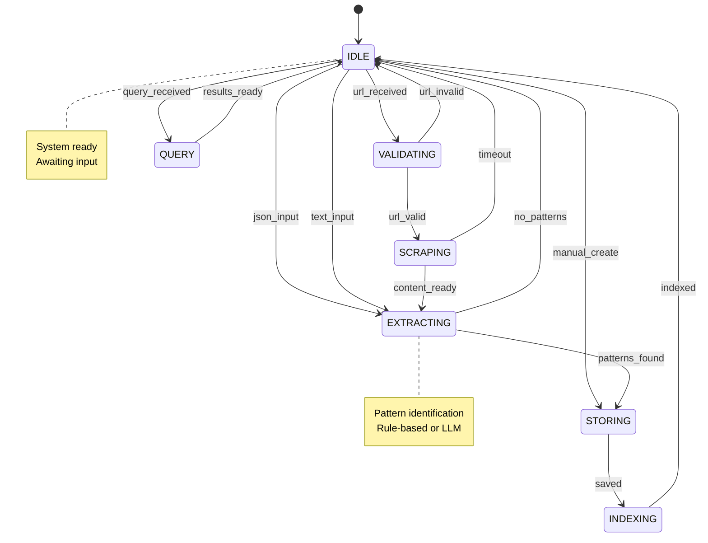
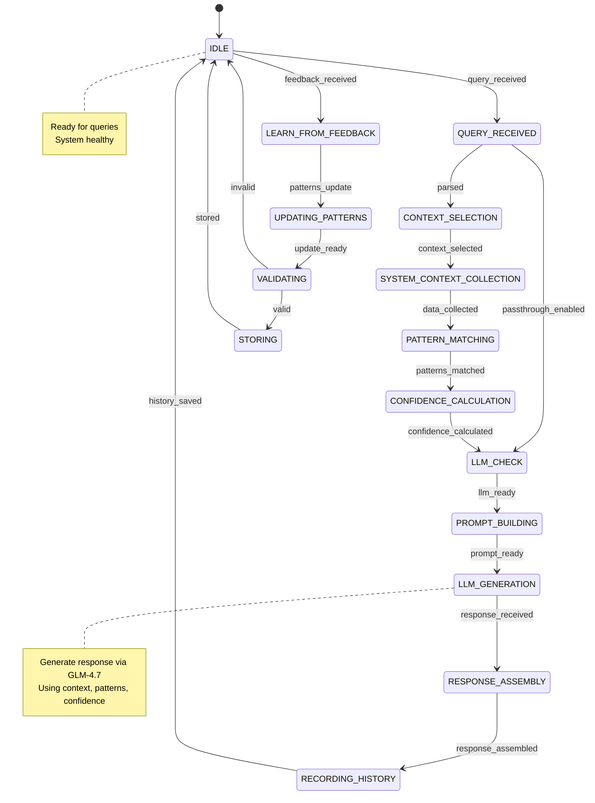

# EEFrame as a State Machine

## Overview

The EEFrame (Expertise Extraction Framework) can be modeled as a hierarchical state machine with two primary subsystems, each managing distinct states and transitions. This document describes the system's behavior using state machine notation.

---

## System Architecture

```
┌─────────────────────────────────────────────────────────────────────┐
│                         EEFRAME SYSTEM                               │
│                                                                      │
│  ┌─────────────────────┐     ┌─────────────────────────────────┐   │
│  │   OMV CO-PILOT      │     │   EXPERTISE SCANNER             │   │
│  │   (Port 3000)       │     │   (Port 3001)                   │   │
│  │                     │     │                                 │   │
│  │  State: IDLE →      │     │  State: IDLE →                 │   │
│  │    ASSISTING →      │     │    INGESTING →                 │   │
│  │    LEARNING         │     │    EXTRACTING →                │   │
│  │                     │     │    INDEXING                    │   │
│  └─────────────────────┘     └─────────────────────────────────┘   │
│                                                                      │
│  Shared States: PATTERN_STORE, USER_HISTORY, KNOWLEDGE_GRAPH        │
└─────────────────────────────────────────────────────────────────────┘
```

---

## State Machine Diagram

### Expertise Scanner State Machine

```
                    ┌─────────────────┐
                    │    INITIAL      │
                    └────────┬────────┘
                             │
                    ┌────────▼────────┐
                    │      IDLE       │◄──────────────────┐
                    └────────┬────────┘                   │
                             │                            │
         ┌───────────────────┼───────────────────┐        │
         │                   │                   │        │
    ┌────▼────┐        ┌────▼────┐        ┌────▼────┐   │
    │ INGEST  │        │  QUERY  │        │  MANAGE  │   │
    │_URL     │        │_PATTERNS│        │_PATTERNS │   │
    └────┬────┘        └────┬────┘        └────┬────┘   │
         │                   │                   │        │
         │                   ┌───────────────────┘        │
         │                   │                            │
    ┌────▼──────────────┐   │                            │
    │   VALIDATING      │   │                            │
    └────┬──────────────┘   │                            │
         │                   │                            │
    ┌────▼──────────────┐   │                            │
    │   SCRAPING        │   │                            │
    └────┬──────────────┘   │                            │
         │                   │                            │
    ┌────▼──────────────┐   │                            │
    │   EXTRACTING      │   │                            │
    └────┬──────────────┘   │                            │
         │                   │                            │
    ┌────▼──────────────┐   │                            │
    │   STORING         │   │                            │
    └────┬──────────────┘   │                            │
         │                   │                            │
    ┌────▼──────────────┐   │                            │
    │   INDEXING        │   │                            │
    └────┬──────────────┘   │                            │
         │                   │                            │
         └───────────────────┴────────────────────────────┘
                                 │
                            ┌────▼────┐
                            │  IDLE   │
                            └─────────┘
```

### OMV Co-Pilot State Machine

```
Main Flow:
IDLE → QUERY_RECEIVED → CONTEXT_SELECTION → SYSTEM_CONTEXT_COLLECTION → PATTERN_MATCHING → CONFIDENCE_CALCULATION → LLM_CHECK → PROMPT_BUILDING → LLM_GENERATION → RESPONSE_ASSEMBLY → RECORDING_HISTORY → IDLE

Passthrough Branch:
QUERY_RECEIVED → LLM_CHECK (bypasses CONTEXT_SELECTION through CONFIDENCE_CALCULATION)

Learning Feedback Loop:
IDLE → LEARN_FROM_FEEDBACK → UPDATING_PATTERNS → VALIDATING → STORING → IDLE

Error Handling:
Any state can transition to IDLE on error with appropriate logging.
```

---

## State Definitions

### Expertise Scanner States

| State | Description | Entry Conditions | Exit Conditions |
|-------|-------------|-------------------|-----------------|
| **IDLE** | System ready, awaiting input | System initialization | Input received (URL/Text/JSON) |
| **VALIDATING** | Checking input validity | Input received | Valid input confirmed |
| **SCRAPING** | Extracting content from URL | URL validated | Content retrieved or timeout |
| **EXTRACTING** | Pattern identification | Content available | Patterns extracted |
| **STORING** | Persisting patterns | Patterns extracted | Storage confirmed |
| **INDEXING** | Building search indices | Storage confirmed | Indexing complete |
| **QUERY** | Pattern search/retrieval | Query received | Results returned |

### OMV Co-Pilot States

| State | Description | Entry Conditions | Exit Conditions |
|-------|-------------|-------------------|-----------------|
| **IDLE** | System ready, awaiting query | Initialization or task complete | Query received |
| **QUERY_RECEIVED** | New user query arrived | User submits query | Query parsed |
| **CONTEXT_SELECTION** | Selecting specialist context based on query keywords | Query parsed | Context selected |
| **SYSTEM_CONTEXT_COLLECTION** | Gathering OMV system data via SSH | Context selected or diagnostics needed | Data collected |
| **PATTERN_MATCHING** | Searching knowledge base for relevant patterns | Data available | Patterns found/scored |
| **CONFIDENCE_CALCULATION** | Computing confidence score based on pattern matches | Patterns scored | Confidence calculated |
| **LLM_CHECK** | Verifying LLM availability | Confidence calculated | LLM ready |
| **PROMPT_BUILDING** | Assembling prompt with context, data, patterns | LLM ready | Prompt ready |
| **LLM_GENERATION** | Generating response via GLM-4.7 API | Prompt ready | Response received |
| **RESPONSE_ASSEMBLY** | Formatting response with confidence and patterns | Response received | Response prepared |
| **RECORDING_HISTORY** | Logging interaction to trace store | Response sent | History saved |
| **LEARN_FROM_FEEDBACK** | Updating pattern scores based on user feedback | Feedback received | Patterns updated |
| **UPDATING_PATTERNS** | Modifying knowledge base patterns | Learning triggered | Update confirmed |
| **VALIDATING** | Quality check for pattern updates | Patterns modified | Validation passed |
| **STORING** | Persisting updated patterns | Validation passed | Storage confirmed |

**Note:** Passthrough chat mode bypasses CONTEXT_SELECTION, SYSTEM_CONTEXT_COLLECTION, PATTERN_MATCHING, and CONFIDENCE_CALCULATION states, going directly from QUERY_RECEIVED to LLM_CHECK.

---

## Transition Table

### Expertise Scanner Transitions

```
┌────────────────┬───────────────┬─────────────────┬─────────────────────┐
│ FROM_STATE     │ EVENT         │ TO_STATE        │ ACTION              │
├────────────────┼───────────────┼─────────────────┼─────────────────────┤
│ IDLE           │ url_received  │ VALIDATING      │ Parse URL           │
│ VALIDATING     │ url_valid     │ SCRAPING        │ Init scraper        │
│ VALIDATING     │ url_invalid   │ IDLE            │ Return error        │
│ SCRAPING       │ content_ready │ EXTRACTING      │ Call extractor      │
│ SCRAPING       │ timeout       │ IDLE            │ Log failure         │
│ EXTRACTING     │ patterns_found│ STORING         │ Prepare JSON        │
│ EXTRACTING     │ no_patterns   │ IDLE            │ Return empty        │
│ STORING        │ saved         │ INDEXING        │ Update indices      │
│ INDEXING       │ indexed       │ IDLE            │ Return success      │
│ IDLE           │ query_received│ QUERY           │ Search patterns     │
│ QUERY          │ results_ready │ IDLE            │ Return results      │
│ IDLE           │ json_input    │ EXTRACTING      │ Process inbox       │
│ IDLE           │ text_input    │ EXTRACTING      │ Extract from text   │
│ IDLE           │ manual_create │ STORING         │ Validate & save     │
└────────────────┴───────────────┴─────────────────┴─────────────────────┘
```

### OMV Co-Pilot Transitions

```
┌──────────────────────┬──────────────────────┬──────────────────────┬─────────────────────────────┐
│ FROM_STATE           │ EVENT                │ TO_STATE             │ ACTION                      │
├──────────────────────┼──────────────────────┼──────────────────────┼─────────────────────────────┤
│ IDLE                 │ query_received       │ QUERY_RECEIVED       │ Log query                   │
│ QUERY_RECEIVED       │ parsed               │ CONTEXT_SELECTION    │ Select specialist context   │
│ QUERY_RECEIVED       │ passthrough_enabled  │ LLM_CHECK            │ Bypass knowledge base       │
│ CONTEXT_SELECTION    │ context_selected     │ SYSTEM_CONTEXT_COLLECTION │ Start SSH data collection  │
│ SYSTEM_CONTEXT_COLLECTION │ data_collected      │ PATTERN_MATCHING      │ Search knowledge patterns   │
│ PATTERN_MATCHING     │ patterns_matched     │ CONFIDENCE_CALCULATION │ Compute confidence score    │
│ CONFIDENCE_CALCULATION │ confidence_calculated │ LLM_CHECK            │ Verify LLM availability     │
│ LLM_CHECK            │ llm_ready            │ PROMPT_BUILDING      │ Assemble prompt with context│
│ PROMPT_BUILDING      │ prompt_ready         │ LLM_GENERATION       │ Call GLM-4.7 API            │
│ LLM_GENERATION       │ response_received    │ RESPONSE_ASSEMBLY    │ Format response with confidence │
│ RESPONSE_ASSEMBLY    │ response_assembled   │ RECORDING_HISTORY    │ Save to trace store         │
│ RECORDING_HISTORY    │ history_saved        │ IDLE                 │ Return response to user     │
│ IDLE                 │ feedback_received    │ LEARN_FROM_FEEDBACK  │ Update pattern scores       │
│ LEARN_FROM_FEEDBACK  │ patterns_update      │ UPDATING_PATTERNS    │ Modify knowledge base       │
│ UPDATING_PATTERNS    │ update_ready         │ VALIDATING           │ Quality check updates       │
│ VALIDATING           │ valid                │ STORING              │ Persist updated patterns    │
│ VALIDATING           │ invalid              │ IDLE                 │ Reject changes              │
│ STORING              │ stored               │ IDLE                 │ Confirm storage             │
└──────────────────────┴──────────────────────┴──────────────────────┴─────────────────────────────┘
```

---

## Sub-State Machines

### Ingestion Job State Machine

```
┌─────────┐    create    ┌─────────┐    start    ┌───────────┐
│  NONE   │─────────────▶│ QUEUED  │────────────▶│ PROCESSING│
└─────────┘              └─────────┘             └─────┬─────┘
                                                    │
                              ┌─────────────────────┴───────────────┐
                              │                                     │
                        ┌─────▼──────┐                       ┌──────▼──────┐
                        │ COMPLETED  │                       │   FAILED    │
                        └────────────┘                       └─────────────┘
```

### Pattern Lifecycle State Machine

```
┌───────────┐    extract    ┌──────────┐    validate    ┌───────────┐
│ RAW_DATA  │─────────────▶│ DRAFT    │─────────────▶│ APPROVED  │
└───────────┘              └──────────┘               └─────┬─────┘
                                                           │
                        ┌──────────────────────────────────┴────────┐
                        │                                           │
                  ┌─────▼─────┐                            ┌───────▼──────┐
                  │ ACTIVE    │                            │ DEPRECATED   │
                  └─────┬─────┘                            └──────────────┘
                        │
                  ┌─────▼─────┐
                  │ ARCHIVED  │
                  └───────────┘
```

---

## Concurrent States

The system maintains multiple concurrent state machines:

```
┌─────────────────────────────────────────────────────────────┐
│                    SYSTEM STATE                             │
├─────────────────────────────────────────────────────────────┤
│                                                             │
│  ┌─────────────────┐  ┌─────────────────┐  ┌─────────────┐ │
│  │ HTTP_SERVER     │  │ JOB_QUEUE       │  │ PATTERN_DB  │ │
│  │ State: RUNNING  │  │ State: ACTIVE    │  │ State: SYNCED│ │
│  └─────────────────┘  └─────────────────┘  └─────────────┘ │
│                                                             │
│  ┌─────────────────┐  ┌─────────────────┐  ┌─────────────┐ │
│  │ LLM_CLIENT      │  │ SCRAPER         │  │ KNOWLEDGE_   │ │
│  │ State: READY    │  │ State: IDLE     │  │ GRAPH        │ │
│  └─────────────────┘  └─────────────────┘  │ State: BUILT │ │
│                                          └─────────────┘ │
└─────────────────────────────────────────────────────────────┘
```

---

## State Persistence

### Checkpoint States

```
┌─────────────────────────────────────────────────────────────┐
│                    PERSISTENT LAYER                         │
├─────────────────────────────────────────────────────────────┤
│                                                             │
│  /data/patterns/{domain}/patterns.json  ← Pattern states    │
│  /data/raw/{domain}/                  ← Raw content states │
│  /data/knowledge_graph/               ← Graph state        │
│  /data/crawl_progress.json            ← Job state          │
│  /data/history/                       │ Interaction states │
│                                                             │
└─────────────────────────────────────────────────────────────┘
```

On system restart, states are restored from:
- **Pattern Database**: All approved patterns
- **Job Progress**: Incomplete jobs resumed
- **User History**: Previous interactions
- **Knowledge Graph**: Pattern relationships

---

## Event-Driven Architecture

### External Events

```
┌─────────────────────────────────────────────────────────────┐
│                        EVENTS                               │
├─────────────────────────────────────────────────────────────┤
│                                                             │
│  INPUT_EVENTS:                                              │
│  ├── url_submitted(url, domain)                            │
│  ├── text_submitted(text, domain)                          │
│  ├── json_uploaded(file, domain)                           │
│  ├── query_received(query_string)                          │
│  └── feedback_received(pattern_id, rating)                 │
│                                                             │
│  SYSTEM_EVENTS:                                             │
│  ├── job_timeout(job_id)                                   │
│  ├── scrape_failure(url, error)                            │
│  ├── extraction_failed(content, error)                     │
│  └── storage_error(pattern, error)                         │
│                                                             │
│  TIMER_EVENTS:                                              │
│  ├── polling_tick()                                        │
│  ├── job_timeout_check()                                   │
│  └── index_update_trigger()                                │
│                                                             │
└─────────────────────────────────────────────────────────────┘
```

---

## Guard Conditions

### Transition Guards

```python
# State transition guards
def can_transition_to_extracting(state):
    return (
        state.current_state == "SCRAPING" and
        state.content_length > 0 and
        state.extractor_available
    )

def can_transition_to_assisting(state):
    return (
        state.current_state == "SEARCHING" and
        (state.patterns_found or state.context_data) and
        state.llm_client_ready
    )

def can_store_pattern(state):
    return (
        state.current_state == "EXTRACTING" and
        state.pattern_count > 0 and
        state.confidence_score >= 0.5
    )
```

---

## State Machine Pseudocode

### Expertise Scanner

```
STATE = IDLE
JOB_QUEUE = []
PATTERN_DB = load_patterns()

while True:
    event = wait_for_event()

    if STATE == IDLE:
        if event.type == "URL_RECEIVED":
            STATE = VALIDATING
            job = create_job(event.url)
            JOB_QUEUE.append(job)

        elif event.type == "QUERY_RECEIVED":
            STATE = QUERY
            results = search_patterns(event.query)
            send_response(results)
            STATE = IDLE

    elif STATE == VALIDATING:
        if is_valid_url(job.url):
            STATE = SCRAPING
            start_scraper(job)
        else:
            fail_job(job)
            STATE = IDLE

    elif STATE == SCRAPING:
        if event.type == "CONTENT_READY":
            STATE = EXTRACTING
            start_extraction(job, event.content)

    elif STATE == EXTRACTING:
        if event.type == "PATTERNS_EXTRACTED":
            STATE = STORING
            save_patterns(event.patterns)

    elif STATE == STORING:
        if event.type == "SAVE_CONFIRMED":
            STATE = INDEXING
            update_indices(event.patterns)

    elif STATE == INDEXING:
        if event.type == "INDEX_UPDATED":
            complete_job(job)
            STATE = IDLE
```

### OMV Co-Pilot

```
STATE = IDLE
KNOWLEDGE_BASE = load_patterns()
HISTORY = load_history()

while True:
    event = wait_for_event()

    if STATE == IDLE:
        if event.type == "QUERY_RECEIVED":
            STATE = QUERY_RECEIVED
            current_query = event.query

    elif STATE == QUERY_RECEIVED:
        if event.type == "PARSED":
            if event.passthrough:
                STATE = LLM_CHECK
            else:
                STATE = CONTEXT_SELECTION
                context = select_context(current_query)
        elif event.type == "PASSTHROUGH_ENABLED":
            STATE = LLM_CHECK

    elif STATE == CONTEXT_SELECTION:
        if event.type == "CONTEXT_SELECTED":
            STATE = SYSTEM_CONTEXT_COLLECTION
            start_data_collection(context)

    elif STATE == SYSTEM_CONTEXT_COLLECTION:
        if event.type == "DATA_COLLECTED":
            STATE = PATTERN_MATCHING
            patterns = match_patterns(event.data)

    elif STATE == PATTERN_MATCHING:
        if event.type == "PATTERNS_MATCHED":
            STATE = CONFIDENCE_CALCULATION
            confidence = calculate_confidence(event.patterns)

    elif STATE == CONFIDENCE_CALCULATION:
        if event.type == "CONFIDENCE_CALCULATED":
            STATE = LLM_CHECK
            check_llm_availability()

    elif STATE == LLM_CHECK:
        if event.type == "LLM_READY":
            STATE = PROMPT_BUILDING
            prompt = build_prompt(current_query, context, patterns, confidence)

    elif STATE == PROMPT_BUILDING:
        if event.type == "PROMPT_READY":
            STATE = LLM_GENERATION
            response = call_llm(prompt)

    elif STATE == LLM_GENERATION:
        if event.type == "RESPONSE_RECEIVED":
            STATE = RESPONSE_ASSEMBLY
            formatted_response = format_response(response, confidence, patterns)

    elif STATE == RESPONSE_ASSEMBLY:
        if event.type == "RESPONSE_ASSEMBLED":
            STATE = RECORDING_HISTORY
            record_interaction(current_query, formatted_response)

    elif STATE == RECORDING_HISTORY:
        if event.type == "HISTORY_SAVED":
            send_response(formatted_response)
            STATE = IDLE

    elif STATE == LEARN_FROM_FEEDBACK:
        if event.type == "FEEDBACK_RECEIVED":
            update_pattern_scores(event.feedback)
            STATE = UPDATING_PATTERNS

    elif STATE == UPDATING_PATTERNS:
        if event.type == "UPDATE_READY":
            STATE = VALIDATING
            validate_updates()

    elif STATE == VALIDATING:
        if event.type == "VALID":
            STATE = STORING
            persist_updates()
        elif event.type == "INVALID":
            STATE = IDLE

    elif STATE == STORING:
        if event.type == "STORED":
            STATE = IDLE
```

---

## Mermaid State Diagram

### Expertise Scanner



### OMV Co-Pilot



---

## Current Data State

### OMV Co-Pilot Knowledge Base
- **24 curated patterns** across 5 categories: Storage (6), Network (5), Services (4), Performance (3), Security (4)
- **Pattern storage**: YAML-based in `patterns/manual.yaml`
- **Confidence scoring**: Based on pattern matching with base 0.5, pattern score bonus, high-score bonus
- **Execution tracing**: 10 decision points tracked (query_received → response_assembly)
- **Passthrough mode**: Direct LLM access bypassing knowledge base

### Expertise Scanner Data
- **Domains created**: cooking, python, omv, diy, first_aid, gardening
- **Test patterns**: 14 synthetic patterns with proper structure and relationships
- **Pattern relationships**: 22 edges connecting patterns (related, prerequisites, alternatives)
- **Storage**: JSON files per domain in `data/patterns/{domain}/`
- **Knowledge graph**: Basic structure implemented in `data/knowledge_graph/`

### System Status (as of January 2026)
- **OMV Co-Pilot**: Fully operational with web dashboard (port 3000), API (port 8888), CLI tool
- **Expertise Scanner**: Validated and working with frontend (port 5173), API (port 8889)
- **Data collection**: SSH-based OMV data collection operational; scraping deprioritized in favor of AI-generated JSON inbox

### OMV Server Environment
- OMV 7.7.21-1 (Sandworm/Debian 12)
- 7 storage devices (SATA, NVMe, eMMC)
- 11 network interfaces
- 14 SMB shares configured

## Summary

The EEFrame system operates as a collection of cooperating state machines:

1. **Expertise Scanner**: Manages content ingestion, pattern extraction, and storage
2. **OMV Co-Pilot**: Handles queries, diagnostics, and learning from feedback
3. **Concurrent States**: HTTP server, job queue, pattern database operate independently
4. **Persistent State**: All critical states persisted to disk for recovery
5. **Event-Driven**: Transitions triggered by external events and internal conditions

This state machine model provides:
- **Predictable behavior**: Each state has well-defined entry/exit conditions
- **Error handling**: Failed states can recover or return to idle
- **Scalability**: Jobs queued and processed independently
- **Observability**: State transitions logged for debugging
- **Resumability**: Interrupted jobs can be resumed from last state
